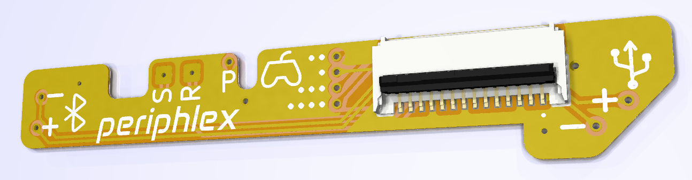

  
  

<h4 align="center">Flex PCB breakout for Bluetooth, USB, GameCube controller ports on trimmed Wii motherboards</h4>

  

## Why?

Building a [Wii portable](https://bitbuilt.net/forums/index.php?forums/wii.123/) requires trimming a Wii motherboard and relocating key peripherals such as USB, Bluetooth, and GameCube controllers. This design breaks out these peripherals from the front of the board to a low-profile FFC connector, allowing for more modular builds.

The board is designed to be semi-permanently installed by soldering to exposed traces for the USB and Bluetooth data lines, and to the vias for the GameCube ports.

## Features

- Solders directly to the top of a Wii motherboard
- 14-pin FFC low profile connector fits cleanly underneath heatsinks/plates
- Fits within the footprint of all but the most aggressive Wii trims
- Breaks out frequently used peripheral lines
  - Bluetooth data
  - USB data
  - GameCube controller data (x4)
  - Reset GPIO (via magnet wire)
  - Soft shutdown GPIOs

## BOM / Ordering

- Grab the Gerber files for the [latest release](https://github.com/loopj/periphlex/releases/latest)
- Order a 2-layer, 0.5oz copper flex PCB from JLCPCB, PCBWay, Gold Phoenix, or similar
- Purchase a Molex 503480-1400 connector ([DigiKey](https://www.digikey.com/en/products/detail/molex/5034801400/2356626), [Mouser](https://www.mouser.com/ProductDetail/Molex/503480-1400?qs=bodV9ulq6GwpLFIuW65CfA%3D%3D))
- Purchase a 14 pin, 0.5mm pitch FFC cable of desired length

## Installation

- Solder the FFC connector to the flex PCB
- Line up the 4 GameCube vias in the middle of the PCB with the GameCube vias on the front of the Wii motherboard, and tape into place
- Mark the position of the holes for Bluetooth and USB using a fine sharpie through to the Wii motherboard
- Remove the flex and inspect the marks, they should be over the traces
- Carefully expose the traces for Bluetooth and USB at the marked locations
  - Use a fine craft knife or dental pick to scratch the solder mask off the correct trace
  - Be careful to not expose the neighboring trace
  - Clean the exposed traces
- Line up the PCB with the GameCube vias again and tape into place
- Solder the following vias on the flex to the motherboard
    - The four GameCube vias
    - The Bluetooth and USB vias (to the exposed traces)
    - The `POWER` GPIO via (*P*)
    - The GND via at the top right of the "X" of the logo
    - The GND via to the right of the connector
- Solder a magnet wire from the "R" pad to the Reset via on the opposite side of the board
- Solder a magnet wire from the "S" pad to the `SHUTDOWN` GPIO via on the opposite side of the board
- Test for continuity, and secure in place with CA glue or kapton tape

## Installation tips

- Remove any excess soldermask from the vias on the motherboard you'll be soldering to
- Pre-tin the vias first
- I like to tin the bottom of the corresponding vias on the flex
- Use lots of flux

## FFC Pinout

| 1    | 2    | 3   | 4   | 5   | 6   | 7   | 8   | 9            | 10           | 11  | 12    | 13    | 14           |
|------|------|-----|-----|-----|-----|-----|-----|--------------|--------------|-----|-------|-------|--------------|
| USB- | USB+ | GND | GC4 | GC3 | GC2 | GC1 | GND | BT- (Data 2) | BT+ (Data 1) | GND | S Pad | R Pad | `POWER` GPIO |

Pin 1 is the right-most pin on the FFC, indicated with a dot.

Don't forget that these pin numbers will likely be reversed on the opposite end of your FFC cable, depending on the connector/cable you use.

## Future enhancements

- Could potentially also break out the USB1 data lines in future

## License

Permissively released under the Solderpad Hardware License v2.1
